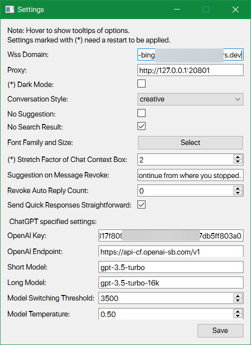

# SydneyQt


一个基于Python和Qt的新必应AI（Sydney版）的桌面客户端。

## 特点

- 使用提示注入的新必应越狱版。
- 可以自由编辑聊天上下文。
- 防止消息撤回。
- 在截取的上下文中支持富文本和纯文本，支持LaTeX。
- 浏览网页，与网页内容交谈。
- 打开文档（包括pdf、docx、pptx），与其交谈。
- 多个自定义提示预设。
- 高度可定制的设置。

## 用法

1. 根据[EdgeGPT](https://github.com/acheong08/EdgeGPT)的README文件中的说明，将你的`cookies.json`放在与`main.py`相同的文件夹中：
   - 为[Chrome](https://chrome.google.com/webstore/detail/cookie-editor/hlkenndednhfkekhgcdicdfddnkalmdm)或[Firefox](https://addons.mozilla.org/en-US/firefox/addon/cookie-editor/)安装Cookie-Editor扩展
   - 前往`bing.com`
   - 打开扩展
   - 点击右下角的`Export`，然后选择`Export as JSON`（这会将你的cookies保存到剪贴板）
   - 将你的cookies粘贴到一个名为`cookies.json`的文件中
2. 安装依赖：

```bash
pip install -r requirements.txt
```

3. 运行程序：

```bash
python main.py
```

## 截图





## 致谢

<https://github.com/acheong08/EdgeGPT>

<https://github.com/InterestingDarkness/EdgeGPT/tree/sydney>